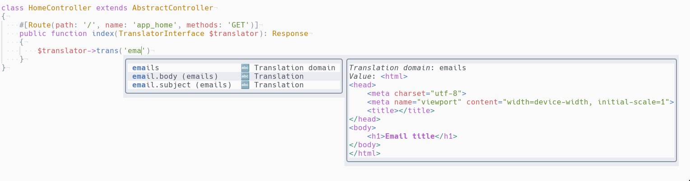

# cmp-symfony-translations

[nvim-cmp](https://github.com/hrsh7th/nvim-cmp) source for symfony translations.  
The source is using `./var/cache/dev/translations/catalog.fr.SHA1.php` file.

This plugin the autocomplete won't work if the above file doesn't exist.



Routes are refreshed every 60 seconds.

## Features
- completes translation domains
- documentation displays full french translation value
- `->addFlash` only displays `flashes_messages` translations
- `message` attribute only displays `validators` translations

## Setup

```lua
require('cmp').setup({
  sources = {
    { name = 'symfony_translations' },
  },
})
```

## Triggers

The plugin is activated for `php` and `twig` filetypes.  
The trigger character is a single quote, and the line must contains
`trans`, `addflash` or `message:`. This covers most of Symfony and twig
translation functions:
- PHP
  - $translation->trans
  - $this->addFlash
  - message attribute for validators
- Twig
  - ''|trans({}, '')

## Configuration

There is no configuration at the moment.

## Todo

- Configure catalog locale
